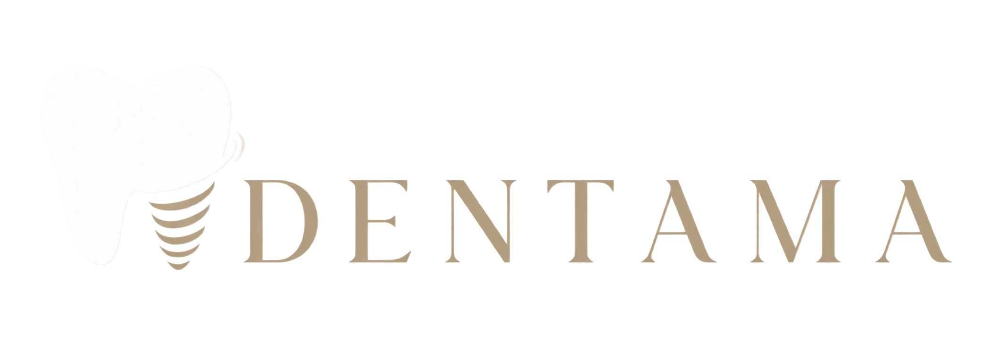

  

<h1 align="center">DENTAMA Website</h1>

  A clean and responsive website for a dental clinic.

## About

This is the current static version of the DENTAMA website.

It includes a responsive navigation menu, reusable content cards, a team page, a pricing page, an appointment form and a location map.

Nothing too fancy here — yet. More features and real content will be added later.

## Disclaimer

> This project is created for demonstration and informational purposes only. All names, prices, contact details, addresses, medical information, reviews and appointment features are fictional or used as placeholders. Nothing on this website represents a real dental clinic, medical advice, an offer of medical services or a working appointment system.

## Pages

- Home
- Team
- Pricing
- Appointment

## Built with

- HTML
- CSS
- Vanilla JavaScript

## Status

Work in progress. Currently static.
